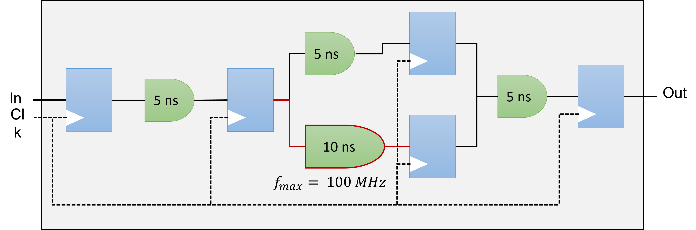

# Reporting & Profiling SYCL programs for Intel® FPGA cards

After having spent some time to write your kernel and debug functional problems, it's now time to take advantage of the accelerator. For this purpose, we need to introduce some definitions that should be kept in mind when analyzing your design.


## Definitions


!!! abstract "Pipelining (see FPGA Optimization Guide for Intel® oneAPI Toolkits)"
    Pipelining is a design technique used in synchronous digital circuits to increase fMAX. Pipelining involves
    adding registers to the critical path, which decreases the amount of logic between each register. Less logic
    takes less time to execute, which enables an increase in f MAX.
    The critical path in a circuit is the path between any two consecutive registers with the highest latency. That
    is, the path between two consecutive registers where the operations take the longest to complete.
    Pipelining is especially useful when processing a stream of data. A pipelined circuit can have different stages
    of the pipeline operating on different input stream data in the same clock cycle, which leads to better data
    processing throughput.
    


!!! abstract "Maximum Frequency (fMAX)"
    The **fMAX** of a digital circuit is its highest possible clock frequency, determining the maximum rate for updating register outputs. This speed is constrained by the physical propagation delay of the signal across the combinational logic between consecutive register stages. The delay is affected by the complexity of the combinational logic in the path, and the path with the greatest number of logic elements and highest delay sets the speed limit for the entire circuit, often known as the **critical path**. The fMAX is the reciprocal of this critical path delay, and having a high fMAX is desirable as it leads to better performance when there are no other restrictions.
    


!!! abstract "Throughput"
    **Throughput** in a digital circuit refers to the speed at which data is handled. When there are no other limiting factors, a higher fMAX leads to increased throughput, such as more samples per second. Often synonymous with performance, throughput is frequently used to gauge the effectiveness of a circuit.
    

!!! abstract "Latency"
    **Latency** measures the duration to complete operations in a digital circuit, and it can be assessed for individual tasks or the whole circuit. It can be measured in time units like microseconds or clock cycles, with the latter often preferred. Measuring latency in clock cycles separates it from the circuit's clock frequency, making it easier to understand the real effects of modifications on the circuit's performance.
    

!!! abstract "Occupancy"
    The **occupancy** of a datapath at a specific moment signifies the fraction of the datapath filled with valid data. When looking at a circuit's execution of a program, the occupancy is the mean value from the beginning to the end of the program's run. Parts of the datapath that are unoccupied are commonly called bubbles, akin to a CPU's no-operation (no-ops) instructions, which don't influence the final output. Minimizing these bubbles leads to greater occupancy. If there are no other hindrances, optimizing the occupancy of the datapath will boost throughput.
    <figure markdown>
        
       <figcaption>Occupancy: $\frac{2}{5}=40\%$</figcaption>
    </figure>

## Reporting

If you instruct the DPC++ compiler to stop compiling the design after generating the early image, you will be able to access precious information including performance and area estimates without having to wait many hours.
The FPGA Early Image can be analyzed using the FPGA Optimization Report to provide:

* loop analysis
* area estimates
* kernel memory information 
* scheduler information

* Recall that the FPGA Early image can be obtained using the command: `icpx -fsycl -fintelfpga -qactypes -Xshardware -fsycl-link=early -Xstarget=Stratix10 accumulator.cpp -o accumulator_report.a`

* You can evaluate whether the estimated kernel performance data is satisfactory by going to the <project_dir>/reports/ directory and examining one of the following files related to your application:

1. report.html: This file can be viewed using Internet browsers of your choice
2. <design_name>.zip: Utilize the Intel® oneAPI FPGA Reports tool,i.e., `fpga_report`

!!! tig "Analyzing the FPGA Early Image report"
    === "Setup"
        * First,copy `/project/home/p200117/FPGA/05-accumulator` to  your home folder    
        * Generate you the early image with the report using:
         ```bash
           # Don't forget to be on a node first
           icpx -fsycl -fintelfpga -qactypes -Xshardware -fsycl-link=early -Xstarget=Stratix10 accumulator.cpp -o accumulator_report.a`
         ```
         * The next step is to follow the [Graphical sessions guide](./meluxina.md#graphical-sessions-vnc)
         * Once connected to the vnc session, you should see something like this:
         
         * Open a terminal using the GUI interface and got to `05-accumulator/src/accumulator_report.prj/reports/` directory
         * Open the file `report.html` with firefox
         
    === "Question"
        * Check the loop analysis report. What do you observe ?
        * What is the predicted fMAX ?
        * What is the block scheduled II ? What is its impact ? 
    === "Solution"
        * We have a data-dependency at line 59
        * For each loop iteration, the Intel® oneAPI DPC++/C++ Compiler takes 3 cycles to compute the result of the addition and then stores it in the variable temp_sum
        * We either need to remove the data dependency or to relax it

!!! tig "Analyzing the final FPGA Image report"
    === "Question"
        * Open `/project/home/p200117/FPGA/06-shift_register/src/shift_register.fpga.prj/reports/report.html`
        * Did the shift register solve the problem ? What is now the Initialization Interval ?
    === "Solution"
        * We can force the II using `#pragma II <N>` but it will trigger an error if it can reduced it
        * The shift register is a very efficient design pattern for FPGA programming as it increase the dependence distance between loops.
        * **Relaxation** means increasing this distance
        


## Profiling
